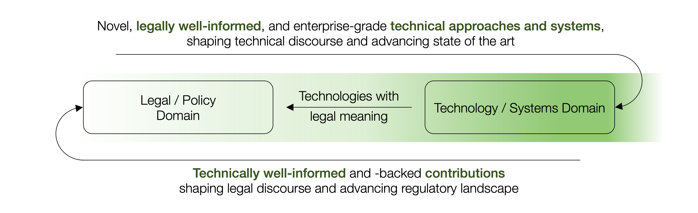

The overall mission of the Privacy Engineering and Policy-Aligned Systems (PEPSys) group, led by [Univ.-Prof. Dr.-Ing. Frank Pallas](/team/fp), is to build bridges between the design and engineering of cutting-edge enterprise- and society-grade systems on the one and the legal and policy-related aspects shaping such systems on the other hand. In so doing, we explicitly follow a design- and engineering-oriented approach. We ideate, design, develop, prototypically implement, and experimentally assess **novel technical approaches and mechanisms consciously addressing so far underrepresented legal and policy-related concepts and principles**. At the same time, we also engage in introducing and "translating" technical concepts into legal and policy-related discourses. 

Our research is originally rooted in the domain of Privacy Engineering, where we made significant technical contributions towards privacy principles such as [transparency](https://scholar.google.com/scholar?oi=bibs&hl=en&cluster=17534929842019305805), [purpose limitation](https://dl.acm.org/doi/abs/10.1145/3341105.3375764), or [data access and portability](https://doi.org/10.1007/978-3-031-34444-2_9) and established an overall agenda that consciously incorporates the specific challenges arising in the adoption of **privacy enhancing technologies** to complex real-world systems and the respective ["second-order non-functional properties"](https://scholar.google.com/scholar?oi=bibs&hl=en&cluster=17937753304434579353). The conscious integration of legally well-informed insights hereby allows for **technologies with particular legal meaning**. On this basis, we are currently reaching out to other policy domains calling for proper technical materializations and alignment. In so doing, we particularly look at recent regulations from the "digital" space (AI Act, Digital Services Act, Data Act, Digital Markets Act, etc.) as well as other regulations affecting enterprise-grade systems in domains of particular societal relevance (energy, health, SDGs, NIS 2, ...).

Besides such design- and engineering-focused activities, we also engage in the cross-disciplinary contextualization of technical givens and concepts and, thus, their proper comprehension and reflection in non-technical (esp. legal / regulatory) discourses. Together with the above-mentioned activities translating non-technical concepts into concrete technical materializations, we thereby work towards a more integrative **"technology-policy co-design"** which counteracts the manifold misconceptions, frictions, and dysfunctionalities that currently characterize the interplay between legal / policy-related givens and the concrete design and implementation of real-world, enterprise- and society grade systems. 

Along these lines, we are continuously looking for new and thrilling challenges arising at the intersection of cutting-edge digital technologies and societally relevant regulations and policies. In this regard, we similarly appreciate ad-hoc bi-directional exchanges with partners from industry, research, and administration as well as longer-term collaborations and projects – in Salzburg, Austria, and from all over the world. For questions of any kind, just [drop us a line](mailto:frank.pallas@plus.ac.at).

Some exemplary previous research projects are listed in our [projects section](/projects). For always up-to-date activities of our PEPSys group, see what's going on via Twitter / X ([#PEPSys](https://twitter.com/hashtag/PEPSys?f=live)) or Linkedin ([#PEPSys](https://www.linkedin.com/feed/hashtag/?keywords=pepsys))

